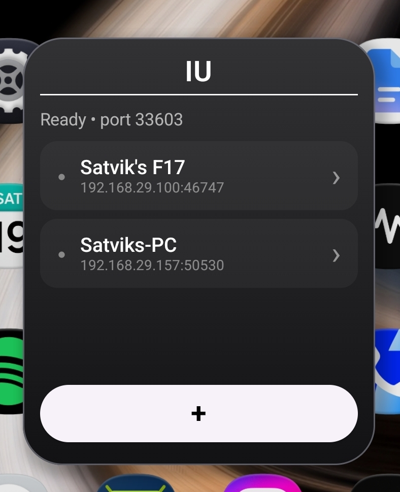
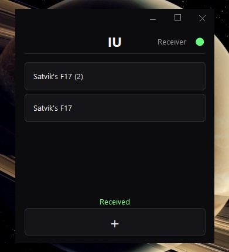

# IU

**IU** is a lightweight LAN based wireless file-transfer system for moving files between a Windows PC and Android devices over a local network.

## Screenshots

<table>
  <tr>
    <td align="center" style="border: none;">
      
      <br>
      <b>Android</b>
    </td>
    <td align="center" style="border: none;">
      
      <br>
      <b>Windows</b>
    </td>
  </tr>
</table>

## Features

* Wireless file transfer
* Transfer single or multiple files
* Automatic handling of duplicate filenames
* Device discovery over the local network
* No cloud storage required for transfers
* Available on sharesheet on Android Devices (so you can go file -> share -> IU)
* Available as a quick settings tile for Android notification panel
* Launches on startup on Windows and stays in system tray to make file sharing as seamless as connecting to a wifi.
* 0 data/quality loss over transfers
* Faster than bluetooth file transfer
* Longer range than bluetooth (as much as the wifi being shared)

## Notes for users

* The devices must be on the same network (ie same wifi or via mobile hotspot.)
* Files are stored in `~/Downloads` on Windows and `~/Downloads/IU` on Android.
* Uninstalling IU doesn't remove the `~/Downloads/IU` folder from Android so your files aren't lost.
* The PC app is always on the systems tray in the taskbar only so do not expect to find it on the taskbar as an app window.
* IU Launches on Windows startup and stays in the systems tray so that it can be as accessible as an inbuilt wifi/bluetooth utility.
* The quick settings tile opens a different IU port while launching the app opens a different independent IU port so if both are turned on you might see 2 entries of the same device in other devices.
* IU currently does not use encryption for file transfers. It is intended for use on trusted local networks, such as your personal Wi-Fi or a private mobile hotspot. Avoid using IU on untrusted networks, as transferred data could potentially be intercepted.

## How it works

IU uses the available local network to send files between devices connected to the same network.

Files are transferred directly between the devices rather than being uploaded to an external server.

## Project structure

```text
IU/
├── android/       # Android application
├── windows/       # Windows application
├── README.md
└── LICENSE
```

Generated build output, caches, installers and other temporary files are excluded from the repository.

## Releases

Compiled application packages are distributed through **GitHub Releases** rather than being committed to the source repository.

Releases may contain:

* `IU.apk` — Android application
* `IU Setup.exe` — Windows installer

## Status

IU is a personal project I created to ease my own workflow. I'm putting it as open source on GitHub for others to collaborate their ideas and also for them to use it for themselves.

The core wireless file-transfer functionality is operational, with additional features and improvements being developed over time.

## Features to add
- [ ] Start acceptor at launch in windows
- [ ] Right click explorer integration in Windows (with list of devices in the dropdown itself)
- [ ] Custom device naming
- [ ] Set custom recieved files location
- [ ] Folder Transfers -> Directory manifest + individual files transfer
- [ ] Drag and drop on windows
- [ ] Automatic retry in network failure
- [ ] Transfer cancellation (crucial for large file transfers)
- [ ] Notification for recieved files on Android even on app acceptor
- [ ] Windows app UI redesign to match android ui

## Bugs to fix
- [x] Blank area around the window is not clickable
- [ ] Multiple recievers on Android
- [ ] Scroll not present in Android
- [ ] Notification bar lagging when recieving via quick tile reciever

> **⚠️ Development Notice**
>
> The current release is behind the latest development version. It does not yet include the latest UI changes, stability improvements, and other ongoing updates. These changes will be included in a future release.

